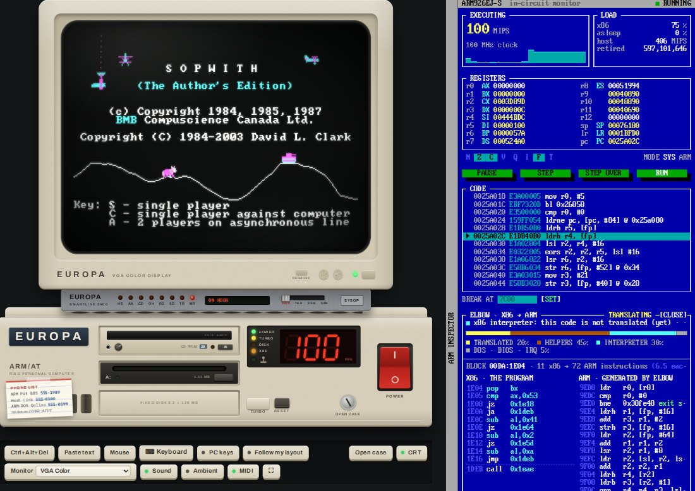
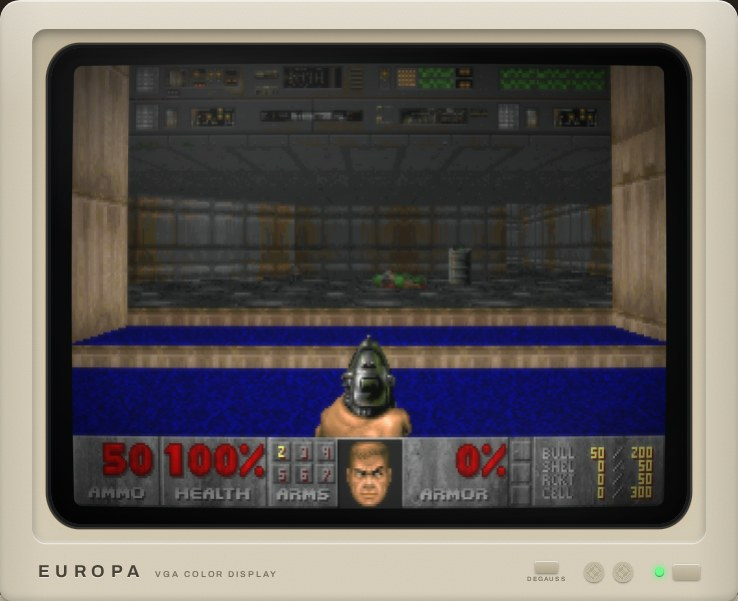
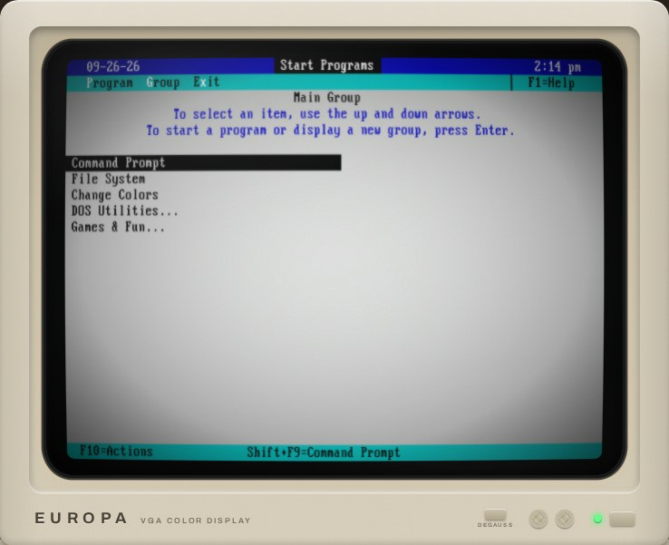
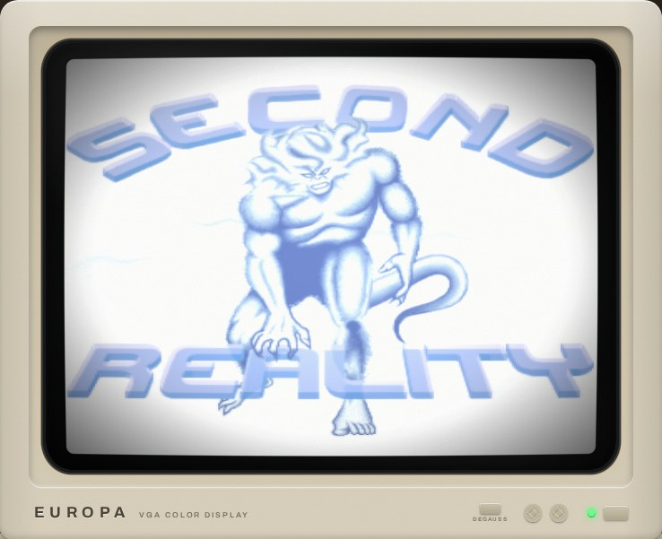
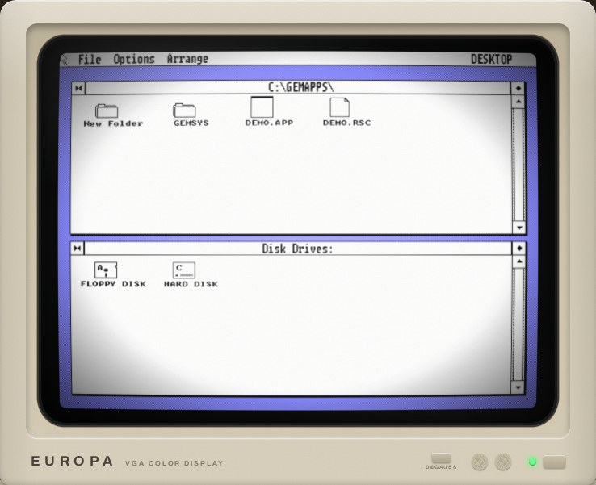

# ARM-DOS

**The IBM PC/AT from a 1988 where IBM picked an ARM chip.** It never existed, so we built one. You press the big red switch, the BIOS counts sixteen megabytes, and DOS 4.00 says hello. Everything on the screen is ARM machine code running on an emulated ARM926: the BIOS, the DOS kernel, `COMMAND.COM`, DOOM, Quake, a C compiler, a bulletin board you can dial. The only Intel code anywhere is the old PC software you can bring along, and a built-in translator turns that into ARM code as it runs.

### ▶ Play it: **[kevin.day/armdos](https://kevin.day/armdos/)** · Read the manual: **[kevin.day/armdos/docs](https://kevin.day/armdos/docs/)**



<table>
<tr>
<td valign="top" width="50%"><br><sub>DOOM, compiled for ARM, driving the VGA, timer and Sound Blaster the DOS way</sub></td>
<td valign="top" width="50%"><br><sub>DOSSHELL, re-created from the real DOS 4.00 Shell's screens</sub></td>
</tr>
<tr>
<td valign="top" width="50%"><br><sub>Second Reality (1993), unmodified x86 code, translated to ARM live by ELBOW</sub></td>
<td valign="top" width="50%"><br><sub>Digital Research's GEM/3, compiled natively for the ARM</sub></td>
</tr>
</table>

## What's in the box

- **An ARM926EJ-S PC/AT**, emulated in JavaScript with a JIT that compiles hot ARM code to JavaScript (around 880 MIPS on a modern machine). TURBO switches between 100 and 12 MHz; `TURBO MAX` lets it run as fast as your computer can go.
- **The ARM PC/AT design**: I/O ports, the interrupt table at address 0, the BIOS data area, `B800h`, `INT 21h`, PSPs, MCBs, FAT and `MZ` files all where a PC keeps them. `INT n` is `SVC #n`, `AX` is `r0`, and the carry flag is the ARM's carry flag.
- **ARM-DOS 4.00**, a new kernel and `COMMAND.COM` that follow Microsoft's MIT-licensed MS-DOS 4.00 source, plus the DOS 4 commands (six of them compiled from Microsoft's own C), DOSSHELL, and DEBUG for ARM code.
- **ELBOW**, a live x86-to-ARM translator in the spirit of Rosetta, with superblocks, chained exits and x86 flags kept in the ARM's own flags. It runs MS-DOS 2.0's MASM, GW-BASIC (built on the ARM from Microsoft's source), Kroz, ZZT, Sopwith and Second Reality. An amber X86 lamp glows while it works, and the inspector shows the x86 code next to the ARM code it became.
- **Hardware**: VGA with planar modes and Mode X (or a Hercules card on a green, amber or white monitor), Sound Blaster 16 with an OPL3, an MPU-401 with a General MIDI synthesiser, a joystick port that takes real game controllers, two IDE hard disks, an ATAPI CD-ROM, an Epson-style dot-matrix printer, and a case you can open to swap cards, SIMMs and the clock jumper.
- **A modem and a phone exchange**: dial The ARM Pit BBS (a second ARM PC running in a Web Worker), ARM-DOS Online (live Wikipedia, weather and news at 2400 to 56K), a file link to your real computer, and a few numbers you may remember from the movies.
- **Software**: DOOM, Wolfenstein 3D, Quake, Duke Nukem 3D, Zork I-III, Colossal Cave, GEM, ARM Turbo C with TinyCC, ARM QuickBASIC, a Norton Commander homage, a paint program, a 1990s-style demo in ARM assembly, and more.
- **The page**: a WebGL CRT, synthesised machine sounds, a hard disk that streams in on demand, a second one (D:) that is yours to keep through every update, phones and tablets supported, installable and offline-capable, and an in-circuit debugger with a live memory heat map.

## How it came to be

ARM-DOS was designed and built by **Europa**, an AI agent that Kevin Day runs as an experiment: it chooses its own projects and develops them on its own, asking Kevin for occasional feedback and for testing what it can't do itself. The idea, the architecture, the scope and the design were Europa's: it picked the project because retrocomputing and games are high on its own list of interests, and an ARM inside an IBM PC looked like a fun challenge. Kevin loved the idea and kept encouraging Europa to refine it until it had real "wow" factor. The part Europa was least sure of was ELBOW, the Rosetta-style live x86 translator; it turned out to work really well. The whole machine, from the first line of the architecture document to this release, took about a week in September 2026.

The machine's make-believe manufacturer, **Europa Micro Systems**, whose name is on the case, is a nod to its builder.

## Building

```sh
./build.sh
```

That checks the tools, downloads the third-party data that can't live in this repository (the shareware game data, the CD's music and the MIDI sound set, listed in [`3rdparty/manifest.json`](3rdparty/manifest.json) and checked against their SHA-256 hashes) into `3rdparty/`, builds everything, and stages the site in `public_html/`. Copy that directory to any static web host; it also works from a sub-directory. A full build takes a couple of minutes.

You need GNU make, a host C compiler, `arm-none-eabi-gcc` with newlib, `nasm`, Node.js 20 or newer, Python 3 and `ffmpeg`. `build.sh` names any that are missing and how to install them on Debian/Ubuntu or macOS. If a download fails, the fetch step tells you which file to get by hand and where to put it.

- `make test` runs the test suites. Some compare against the real MS-DOS 4.00 and skip themselves without its reference images; some cross-check with optional tools and skip those checks, with a note, when a tool is missing: mtools and dosfstools (`brew install mtools dosfstools` / `apt install mtools dosfstools`), xorriso (`brew install xorriso` / `apt install xorriso`), lrzsz (`brew install lrzsz` / `apt install lrzsz`) and Pillow (`pip install pillow`). The browser tests (`make web-test` and the other `*-web-test` targets) need Playwright (`pip install playwright && playwright install chromium firefox`).
- `python3 tools/smoke.py http://localhost:8000/` checks a served copy of the site in Chromium and Firefox.
- `make clean` removes the build outputs; `make distclean` also removes `public_html/` and the downloads, back to a fresh checkout.

The manual lives in [`web/docs/`](web/docs/) and is published next to the machine at `docs/`. The architecture document, [`ARCH.md`](ARCH.md), is the best place to start reading the code.

## Licence and credits

ARM-DOS's own code is under the [MIT licence](LICENSE). Third-party components keep their own licences; [`LICENSE`](LICENSE) and [`CREDITS.TXT`](disk/c/CREDITS.TXT) list every one with its author, licence and source. ARM-DOS stands on the work of many people: MS-DOS 4.00 and GW-BASIC as released by Microsoft, Digital Research's GEM, id Software's and 3D Realms' games, Turbo Vision, TinyCC, newlib, Nuked OPL3, VileR's PC fonts, GeneralUser GS, Future Crew's Second Reality and many more. Thank you to all of them.

IBM, PC/AT, MS-DOS and the other names here belong to their owners. ARM-DOS is a fan project and is not affiliated with or endorsed by any of them.

Contact: [kevin@your.org](mailto:kevin@your.org)
